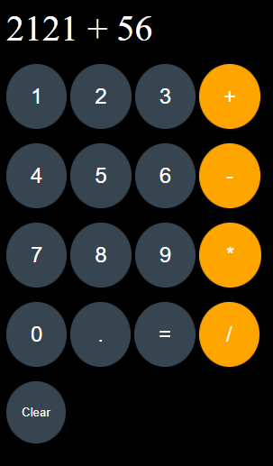

# Calculator App

A simple calculator built using HTML, CSS, and JavaScript, hosted on GitHub Pages. This project is a part of my learning journey to sharpen my frontend development skills.

## Features
- Basic arithmetic operations: Addition, Subtraction, Multiplication and Division.
- Responsive Design for desktop and mobile users.
- Clean and simple UI/UX for easy use.

## Live Demo
You can check out the live version of the calculator here: [Calculator App](https://ajitkumarroy.github.io/calc2/)




## Installation
1. Clone the repository:
   ````bash
   git clone https://github.com/AjitKumarRoy/calc2
2. Navigate to the project directory:
   ````bash
   cd calc2
3. Open `index.html` in your browser to start using  the calculator locally.


## Usage
- Enter the numbers and operators using the buttons provided.
- Click "=" or Press "Enter" to get the result.
- Click "Clear" or Press "Esc" to clear the input.

## Technology Stack
- HTML5 for the structure.
- CSS3 for styling and layout.
- JavaScript for the logic.

## License
This project is licensed under the MIT License - see the [LICENSE](./LICENSE) file for details.


## Contributing
Feel free to fork this project, submit issues, and contribute by creating pull requests!